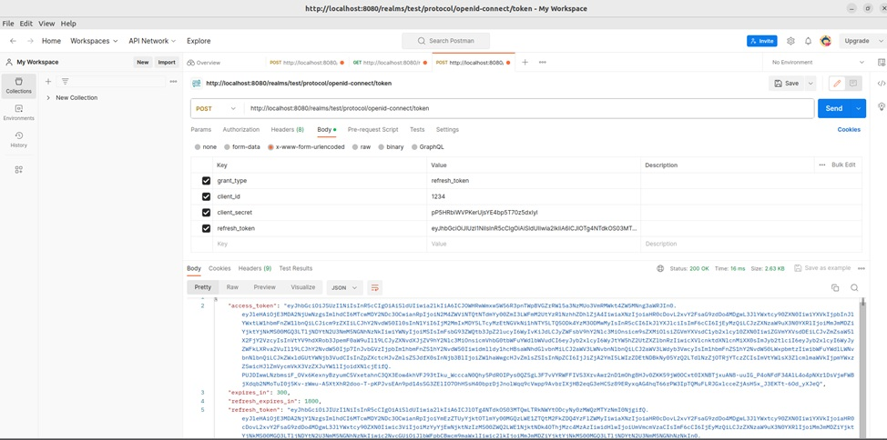

# Web-Backend-Lab3
1. Был выставлен запрет на входящие соединения и разрешение на исходящие соединения. Также были выставлены разрешения для портов 80/tcp и 1488(ssh)

2. В настройках ssh был выставлен порт 1488. Также были выставлены настройки для подключения только одним пользователем и не подключение через Root

3. Был добавлен пользователь с правами доступа <b>root</b>

4. Была установлена postgresql. Также была проведена первичная настройка. Установлен новый пользователь для keycloak

5. Был собран [dockerfile](dockerfile).
> 4 часа потерянного времени. После того, как запустилось - я начал верить в бога

6. Dockerfile запустился ~нет, не с первого раза~

7. Был создан скрипт для автоматического бэкапа данных.

8. Собрал докер 
> Блять, наконец-то

9. Ещё добавил скрипт на автовыполнение в 10:00 ~Спасибо Никите, этим поделился~

10. После чего был создан пользователь

11. А после чего роль

12. Затем созданной группе была создана роль.

12. Получение токена по паролю POST

13. Получение токена по refresh токену POST http://localhost:8080/realms/test/protocol/openid-connect/token 

14. Получение пользователей GET http://localhost:8080/realms/realm/protocol/openid-connect/userinfo

15. Получение информации про реалм GET http://localhost:8080/realms/test/.well-known/uma2-configuration

>P.S. На решение задачи было затрачено 2 дня, 5 банок энергетика, 10 часов музыки, 1 Никита и 1.5 миллиона нервных клеток